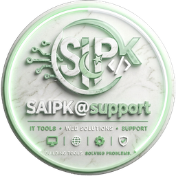

<div align="center">
  
  
  # ContextOS
  ### AI-Powered Cross-App Context Bridge for Windows
  
  **Developed by [SAIPK@support](https://github.com/malakb201)**
  
  *IT Tools • Web Solutions • Support*
  
  *Building Tools. Solving Problems.*

  
  
  
  
  
  

</div>

---

## What is ContextOS?

ContextOS runs silently in the background on Windows and watches all your open apps simultaneously — VS Code, Gmail, Slack, Notion, Figma, Chrome, and any other app on your PC.

When it detects that something in one app **conflicts with** or **answers** something in another app, it shows you a smart popup — before you make a mistake or waste time searching.

### Real examples of what it catches

| Situation | ContextOS does |
|-----------|---------------|
| Email says "don't change auth flow" — you open `AuthService.py` | ⚠ **Conflict alert** shown instantly |
| Slack has the fix for the bug you're debugging right now | 💡 **Answer surfaced** automatically |
| You work on a file for 10+ min — Notion has a matching task | ✓ **Task auto-marked** in-progress |
| Meeting in 5 minutes | 📅 **Briefing** of all relevant files/emails/tasks |
| You return after a break | 🔄 **Resume screen** rebuilds your exact context |

---

## Features

- **Real-time conflict detection** — 15 rules covering all major app combinations
- **Answer surfacing** — finds what you need before you search for it
- **Auto task updates** — marks Notion/Jira tasks based on your activity
- **Meeting briefings** — 5-minute pre-meeting context summary
- **Session resume** — returns you to exactly where you left off
- **Works on ALL apps** — not just a fixed list, any installed Windows app
- **100% offline** — nothing leaves your PC, ever
- **Smart CPU guard** — pauses when system is busy, resumes silently
- **Professional dashboard** — 5-tab UI with real-time data

---

## System Requirements

| Mode | RAM | CPU | OS |
|------|-----|-----|----|
| Lite (rules) | 2 GB | Any dual-core | Windows 7+ |
| Full (AI-ready) | 4 GB | i5 6th gen+ | Windows 10+ |

---

## Quick Start

### Step 1 — Install Python 3.12
Download free from [python.org/downloads](https://python.org/downloads)

### Step 2 — Clone the repo
```bash
git clone https://github.com/malakb201/contextOS.git
cd contextOS
```

### Step 3 — Install dependencies
```bash
python install_deps.py
```

### Step 4 — Run ContextOS
```bash
python main.py
```

The SAIPK@support tray icon appears in your taskbar bottom-right corner.  
Right-click → **Open Dashboard** to see the full interface.

### Step 5 — Run tests (optional)
```bash
python -m pytest tests/ -v
```
Expected: **31 passed**

---

## Project Structure

```
contextOS/
├── main.py                     ← Entry point
├── install_deps.py             ← One-click dependency installer
├── open_dashboard.py           ← Open dashboard directly
├── build_exe.py                ← Build .exe with PyInstaller
├── requirements.txt
│
├── core/                       ← The brain
│   ├── app_reader.py           ← Parses titles from ALL Windows apps
│   ├── app_watcher.py          ← Reads active window every second (win32gui)
│   ├── conflict_detector.py    ← 15 real conflict/answer rules
│   ├── context_engine.py       ← Orchestrates everything + CPU guard
│   ├── session_manager.py      ← Tracks away/return, session snapshots
│   ├── meeting_monitor.py      ← Calendar integration + manual meetings
│   └── startup_manager.py      ← Windows Registry startup entry
│
├── ui/                         ← The interface
│   ├── tray_app.py             ← System tray icon + popup windows
│   └── dashboard.py            ← 5-tab professional dashboard
│
├── data/                       ← Storage
│   ├── config_manager.py       ← settings.json read/write
│   ├── database.py             ← SQLite context memory
│   └── user_data/              ← Created on first run (gitignored)
│
├── utils/
│   ├── logger.py               ← Logging setup
│   └── system_check.py         ← RAM/CPU detection → auto mode select
│
├── tests/
│   └── test_core.py            ← 31 automated tests
│
└── assets/
    └── icons/                  ← SAIPK@support logo, all sizes
```

---

## Dashboard Tabs

| Tab | What it shows |
|-----|--------------|
| **Home** | Stats, current focus topic, active insights, context trail |
| **Insights** | All conflict/answer cards with dismiss/act buttons |
| **Apps** | Every app seen today with event count and last active time |
| **Memory** | Searchable history of all your work context |
| **Settings** | All toggles, mode selector, about section |

---

## How It Detects Conflicts

No AI needed for the core detection. ContextOS uses keyword matching across app window titles:

```
Gmail title:    "Sara: auth flow must not change — Gmail"
VS Code title:  "AuthService.py — myproject — VS Code"

Shared keyword: "auth" → CONFLICT DETECTED → Popup shown
```

Every major app has a dedicated parser:
- **VS Code** → extracts filename + project name
- **Chrome/Edge** → detects Gmail subjects, Slack channels, GitHub repos, Jira tickets
- **Slack desktop** → extracts channel name + workspace  
- **Outlook** → extracts email subject + sender
- **Notion** → extracts page title
- **Figma** → extracts frame/file name
- **Any other app** → generic title parsing

---

## Tech Stack

| Component | Technology |
|-----------|-----------|
| Core engine | Python 3.12 |
| Window reading | pywin32 (win32gui) |
| Database | SQLite (built into Python) |
| Tray icon | pystray + Pillow |
| Dashboard UI | tkinter (built into Python) |
| Tests | pytest |
| Packaging | PyInstaller |

---

## Privacy

- **All processing is local** — no data ever leaves your PC
- **No account required** — no signup, no login
- **No internet needed** — works completely offline
- Database stored at `data/user_data/context.db` on your own machine
- Delete the folder to wipe all stored context

---

## License

MIT License — free to use, modify, and distribute.

---

<div align="center">

**Developed by SAIPK@support**  
IT Tools • Web Solutions • Support  
*Building Tools. Solving Problems.*

⭐ Star this repo if ContextOS helped you!

</div>
